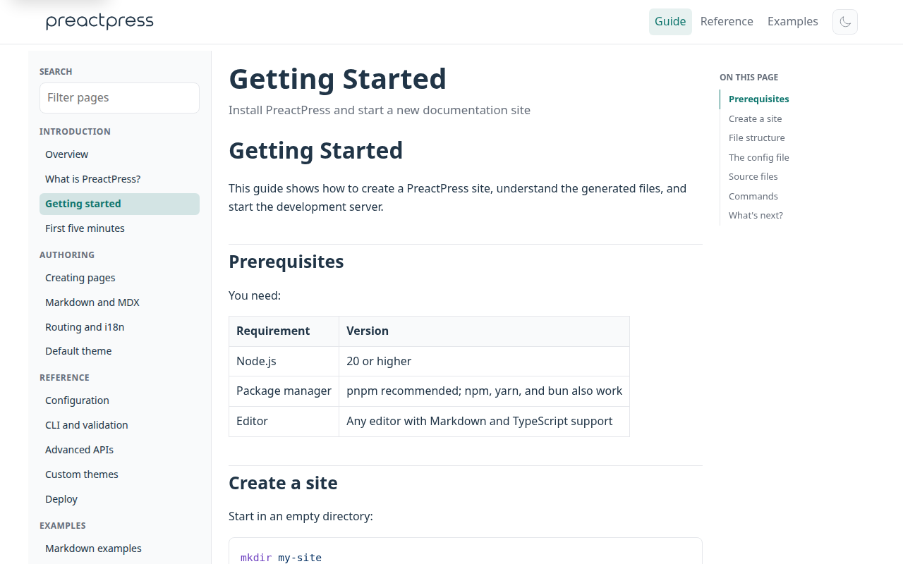
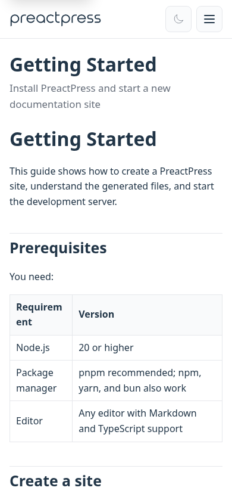

<p align="center">
  <picture>
    <source media="(prefers-color-scheme: dark)" srcset="./assets/logo-dark.svg">
    <source media="(prefers-color-scheme: light)" srcset="./assets/logo-light.svg">
    
  </picture>
</p>

<h1 align="center">PreactPress</h1>

**Preact + Vite static site generator** for documentation, blogs, and marketing sites. Write **Markdown** and **MDX**, use a **VitePress-style** default theme, and ship static HTML — no Node server in production.

<p align="center">
  <a href="https://www.npmjs.com/package/preactpress"></a>
  <a href="https://github.com/kamod-ch/preactpress/actions/workflows/ci.yml"></a>
  <a href="https://github.com/kamod-ch/preactpress/stargazers"></a>
  <a href="https://github.com/kamod-ch/preactpress/blob/main/LICENSE"></a>
</p>

**[Live demo](https://kamod-ch.github.io/preactpress/)** · **[Docs starter](./templates/docs)** · **[npm](https://www.npmjs.com/package/preactpress)** · **[GitHub](https://github.com/kamod-ch/preactpress)** · **[Issues](https://github.com/kamod-ch/preactpress/issues)**

> If PreactPress saves you time, **[star the repo](https://github.com/kamod-ch/preactpress)** — it helps others discover the project.



## Why PreactPress?

Many static site generators are tied to React, Vue, or a heavy runtime. PreactPress targets a smaller stack:

- **Preact-first** — tiny runtime and familiar patterns if you already use React-like APIs.
- **VitePress-like DX** — file-based Markdown routes, docs theme, sidebar, outline, and search out of the box.
- **MDX + Preact** — interactive content and custom themes are Preact components, not Vue SFCs.
- **Static by default** — build once, deploy `dist/` to any static host.

Pair with **[Kamod UI](https://ui.kamod.ch/)** for Preact + Tailwind components inside MDX pages.

## When to use PreactPress

| | PreactPress | VitePress | Astro |
| --- | --- | --- | --- |
| UI stack | Preact + MDX | Vue | Framework-agnostic islands |
| Docs theme | Built-in default | Built-in default | Add-on / DIY |
| Runtime | Small Preact bundle | Vue hydration | Varies by integration |
| Best for | Preact teams, VitePress-like docs, MDX interactivity | Vue documentation sites | Multi-framework content sites |

**Choose PreactPress when** you want VitePress-style documentation workflows with **Preact and MDX**, static output, and a theme you can replace with your own Preact layout.

**Choose something else when** you need Vue (VitePress), React-only ecosystems, or Astro's multi-framework island model.

## Quick start

Requirements: Node 20 or newer. pnpm is recommended; npm and yarn work too.

```bash
mkdir my-site && cd my-site
pnpm dlx preactpress init
pnpm install
pnpm run dev
```

Open [http://localhost:5173](http://localhost:5173).

For the complete documentation starter:

```bash
pnpm dlx preactpress init my-docs --template docs
cd my-docs && pnpm install && pnpm run dev
```

## Starter templates

| Template | Use case | Scaffold |
| --- | --- | --- |
| `default` | Minimal docs site with home hero and guide pages | `pnpm dlx preactpress init` |
| `docs` | Full documentation starter (canonical reference) | `pnpm dlx preactpress init my-docs --template docs` |
| `magazine` | Custom theme with article teasers and tag pages | `pnpm dlx preactpress init my-mag --template magazine` |
| `hono` | Polished product/docs layout with custom Preact theme | `pnpm dlx preactpress init my-site --template hono` |

Browse the [live demo](https://kamod-ch.github.io/preactpress/) for the `docs` template, or run `pnpm run dev:docs` from the package root while contributing.

<p align="center">
  
</p>

## Features

### Authoring

- file-based `.md` and `.mdx` routing
- frontmatter for titles, descriptions, tags, drafts, and layout chrome
- Preact components in MDX
- syntax highlighting, containers, alerts, code groups, includes, snippets, emoji, and optional math

### Theme and navigation

- default theme with responsive nav, sidebar, outline, search, dark mode, tags, and i18n
- home, page, and doc layouts with hero and feature grids
- local search or Algolia DocSearch
- custom themes via Preact layout components

### SEO and deploy

- sitemap, robots, feeds, canonical URLs, Open Graph, and JSON-LD
- static HTML for every route; lazy-loaded Markdown payloads after hydration
- deploy to Netlify, Vercel, Cloudflare Pages, GitHub Pages, S3, or any static host

### Developer experience

- development SSR and static production output
- route rewrites, dynamic routes, content loaders, build hooks, and MPA mode
- `preactpress check` for routes, links, navigation, locales, and drafts

## Commands

| Command | Purpose |
| --- | --- |
| `preactpress init [dir]` | Scaffold a site |
| `preactpress dev [root]` | Start development |
| `preactpress check [root]` | Validate before release |
| `preactpress build [root]` | Generate static output |
| `preactpress preview [root]` | Preview the generated site |

Pass `--base /my-repo/` when building for a GitHub Pages project site.

## Minimal configuration

```ts
export default {
  site: {
    title: 'My docs',
    description: 'Product documentation',
    url: 'https://example.com'
  },
  themeConfig: {
    search: true,
    nav: [{ text: 'Guide', link: '/guide/getting-started' }],
    sidebar: [
      {
        text: 'Guide',
        items: [{ text: 'Getting started', link: '/guide/getting-started' }]
      }
    ]
  }
}
```

Every Markdown or MDX file below `srcDir` becomes a route unless it matches `srcExclude`.

## Documentation

The canonical, runnable documentation lives in [`templates/docs`](./templates/docs). It covers authoring, routing, i18n, the default theme, all configuration options, CLI validation, deployment, hooks, data loaders, dynamic routes, and custom themes.

Use these package scripts while contributing:

```bash
pnpm run build
pnpm test
pnpm run dev:docs
pnpm run check:docs
pnpm run build:docs
```

See [CONTRIBUTING.md](./CONTRIBUTING.md) for package development and [ROADMAP.md](./ROADMAP.md) for current priorities.

## License

MIT.
