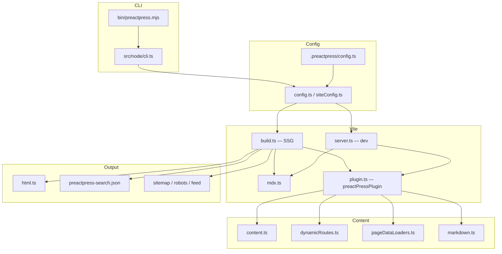
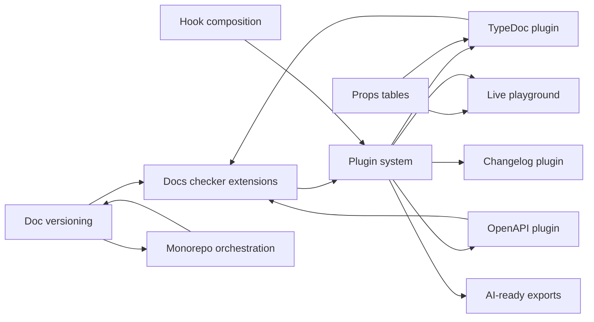

# PreactPress Feature Roadmap — Architecture Audit

> **Status:** Architecture audit (Prompt 1)  
> **Package:** `@kamod-ch/preactpress` v2.2.1  
> **Date:** 2026-07-27  
> **Scope:** Read-only analysis; no production code changes in this phase.

This document captures the current PreactPress architecture, technical debt, and a recommended implementation order for planned extensions. It is intended for maintainers and contributors implementing features in subsequent roadmap prompts.

---

## Table of contents

1. [Executive summary](#executive-summary)
2. [Current architecture](#current-architecture)
3. [Relevant modules and files](#relevant-modules-and-files)
4. [Public and internal APIs](#public-and-internal-apis)
5. [Technical debt](#technical-debt)
6. [Feature integration analysis](#feature-integration-analysis)
7. [Dependencies between new features](#dependencies-between-new-features)
8. [Recommended implementation order](#recommended-implementation-order)
9. [Risks](#risks)
10. [Migration strategy](#migration-strategy)
11. [Test strategy](#test-strategy)
12. [Definition of Done per feature](#definition-of-done-per-feature)

---

## Executive summary

PreactPress is a **single-package** static site generator (not a monorepo) built on **Vite 8 + Preact 10**. It follows a VitePress-like DX: file-based Markdown/MDX routing, a default documentation theme, dev SSR, and production SSG with optional SPA navigation.

The codebase is organized in three layers:

| Layer | Path | Role |
|-------|------|------|
| **Node (build/CLI)** | `src/node/` | CLI, config, content scan, markdown/MDX pipeline, Vite plugin, SSG |
| **Client (runtime)** | `src/client/` | Preact app, SSR entries, default theme |
| **Shared (isomorphic)** | `src/shared/` | Routing, locale, sidebar, search, SEO helpers |

Extensibility today is **config-hook based** (`transformPageData`, `transformHtml`, `transformHead`, `buildEnd`), plus **content loaders**, **dynamic routes**, **route rewrites**, and **custom themes**. There is **no formal plugin system**, **no docs versioning**, and **no TypeDoc/OpenAPI/playground integration** in core.

The recommended path forward:

1. Strengthen foundations (checker, optional deps, extension docs).
2. Introduce a minimal **plugin contract** that wraps existing hooks.
3. Add **content-source plugins** (TypeDoc, OpenAPI, changelog) on top of loaders/build hooks.
4. Layer **versioning** and **monorepo orchestration** as build-time composition.
5. Ship **AI-ready outputs** and **playground** as optional packages to keep core small.

---

## Current architecture

### High-level build flow



### CLI

| Command | Module | Purpose |
|---------|--------|---------|
| `init [dir]` | `init.ts` | Scaffold from one of 9 templates |
| `dev [root]` | `server.ts` | Vite dev server + SSR middleware |
| `build [root]` | `build.ts` | Production SSG |
| `preview` / `serve` | `serve.ts` | Static preview (sirv) |
| `check [root]` | `check.ts` | Route, link, nav, SEO validation |

**Entry:** `bin/preactpress.mjs` → compiled `dist/node/cli.js` (minimist router).

When run from the package root without a site argument, CLI defaults to `templates/default`.

### Configuration system

- **Location:** `.preactpress/config.ts` only (resolved via `paths.ts`).
- **Loading:** Vite `loadConfigFromFile()` in `config.ts`; supports sync object or async factory.
- **Helpers:** `defineConfig()`, `createContentLoader()` in `config-helpers.ts`.
- **Merge:** `resolveConfig()` / `resolveConfigForBuild()` produce immutable `SiteConfig`.

Key defaults:

- `srcDir: "."`, `cleanUrls: true`, `mpa: false`
- `cacheDir: node_modules/.preactpress`
- Bundled default theme unless `theme: "./theme/Layout.tsx"`
- `build.sitemap` / `build.robots`: `true`; `build.feed`: `false`

Passthrough: `vite` key merges into underlying Vite config.

### Content loader

**Discovery** (`content.ts`):

- Glob `**/*.{md,mdx}` under `srcDir`
- Ignore `node_modules`, `.preactpress`, `*.data.ts`, `*.paths.ts`, `srcExclude`
- `mdFileToRoute()` maps files to URL paths; collision detection on scan
- Dynamic bracket templates excluded from static scan

**Page data loaders** (`pageDataLoaders.ts` + `createContentLoader.ts`):

- Co-located `*.data.ts` files default-export a `createContentLoader()` result
- Loaded via `loadSiteModule.ts` (Vite config loader)
- Output merged into page frontmatter as `contentData`

**Dynamic routes** (`dynamicRoutes.ts`):

- `[param].md` + sibling `[param].paths.ts` exporting `{ paths(): [{ params, props? }] }`
- Markdown only (MDX dynamic templates explicitly rejected in `plugin.ts`)

**Rewrites** (`shared/rewrites.ts`):

- Config map: `{ '/alias': '/source' }` applied during scan

**Tag indexes** (`tagIndex.ts`):

- Auto `/tags/{slug}` from frontmatter tags

### Markdown and MDX pipeline

**Markdown** (`markdown.ts`, `markdownInclude.ts`, `markdownSnippets.ts`, `markdownHeadings.ts`):

| Concern | Implementation |
|---------|----------------|
| Frontmatter | gray-matter |
| Parser | markdown-it |
| Highlighting | shiki + @shikijs/transformers |
| Emoji | markdown-it-emoji (opt-in via config) |
| Math | markdown-it-mathjax3 (opt-in) |
| Containers | VitePress-style `::: tip` etc. |
| Alerts | GFM `> [!NOTE]` |
| Includes | `<!--@include: path -->` |
| Snippets | Region/line-range code imports |
| TOC | Custom heading IDs, outline extraction |

**MDX** (`mdx.ts`):

- `@mdx-js/rollup`, `jsxImportSource: "preact"`
- Minimal remark pipeline (`remark-frontmatter` only)
- Full client hydration via dynamic imports

**Runtime split:**

- Markdown → SSR HTML + lazy JSON content chunks
- MDX → hydrated components
- Mermaid → client-side render (`client/mermaid.ts`)

### Routing and static page generation

**Virtual modules** (generated by `preactPressPlugin`):

- `virtual:preactpress-pages` — route registry, metadata, MDX loaders, SSR page map
- `virtual:preactpress-layout` — user or default theme Layout
- `virtual:preactpress-site` — resolved site config snapshot

**Client routing** (`client/app.tsx`):

- History API SPA (unless `mpa: true`)
- Prefetch on hover + viewport
- `routeFromPathname()` respects `site.base`

**SSG** (`build.ts`):

1. Vite client build → `cacheDir/pp-client/`
2. Vite SSR build → `cacheDir/pp-ssr/`
3. Per-route parallel render (limit 12): `transformPageData` → SSR → `pageHtml()` → `transformHtml`
4. Write HTML, content JSON chunks, search index, sitemap, robots, optional feed
5. `buildEnd` hook; incremental cache via `buildCache.ts`

**Output layout:**

- `dist/{route}/index.html` (clean URLs) or `dist/{route}.html`
- `dist/preactpress-content/{encoded-route}.json`
- `dist/preactpress-search.json`, `dist/preactpress-theme.js`
- `dist/sitemap.xml`, `dist/robots.txt`, optional `dist/feed.xml`

**Dev SSR** (`devSsr.ts`): document requests get injected HTML; page JSON at `/__preactpress/page.json?route=…`.

### Theme system

**Default theme:** `src/client/theme-default/` — Layout, NavLinks, SidebarNav, search UI, Hero, Features, ThemeToggle, AlgoliaSearch, `styles.css`.

**Custom themes:** Replace via `theme` config path; must implement `LayoutProps` (`client/types.ts`).

**Page chrome** (`shared/pageChrome.ts`): frontmatter-driven layouts (`doc`, `home`, `page`), hero, features, outline, aside.

**Public theme utilities** (`client/theme-utils.tsx`, exported from `@kamod-ch/preactpress/client`):

- `createMdxHeadingComponents`, `ThemeToggle`, `useStoredThemeSync`
- `withBase`, `isActive`, `classNames`, `slugifyHeading`

**Gap:** No slot/component registry; custom themes must reimplement nav, search, i18n switcher.

### Navigation

- **Nav:** `themeConfig.nav` — top bar, nested dropdowns
- **Sidebar:** global array or path-prefix keyed `Record<prefix, SidebarGroup[]>`
- **Resolution:** `resolveSidebarForRoute()` — longest prefix match
- **Pagination:** `flattenNavLeafItems` / `flattenSidebarLeafItems` for prev/next
- **i18n:** per-locale `themeConfig.nav` / `sidebar` overrides via `locales.{key}.themeConfig`
- **Validation:** `check.ts` validates configured links against route set

No auto-generated sidebar from file tree.

### Search

| Provider | Implementation |
|----------|----------------|
| Local | Build-time `preactpress-search.json`; client fuzzy scoring in `useSiteSearch.ts` |
| Algolia | `@docsearch/js` in default theme; config via `themeConfig.search` |

Scoring weights (title > tags > description > excerpt > route). Max 8 results.

Local search indexes title, description, tags, excerpt — not full MDX body text.

### i18n

- Config: `locales: { root: {...}, de: { link: '/de/', ... } }`
- Content under locale-prefixed directories (e.g. `de/guide/...`)
- `resolveLocales()`, `localeFromRoute()`, `localizedRouteForLocale()` in `shared/locale.ts`
- SEO: `hreflang` alternates in HTML and sitemap

**Gaps:** No missing-translation fallback, no RTL, no locale auto-detection middleware.

### Sitemap and SEO

| Concern | Module |
|---------|--------|
| Title/description templates | `shared/pageMeta.ts` |
| Head tag assembly | `shared/pageHead.ts`, `client/usePageHead.ts` |
| Full HTML document | `node/html.ts` — OG, Twitter, canonical, JSON-LD |
| Favicons | `node/favicon.ts` |
| Sitemap/robots/feed | `build.ts`, `feed.ts` |

Requires `site.url` for sitemap/robots/canonical (silently skipped otherwise).

Hooks: `transformHead`, `transformHtml`.

### Tests

| Layer | Tool | Coverage |
|-------|------|----------|
| Unit | Vitest 4 | `src/node/**`, `src/shared/**` — thresholds 60/65/70/70% |
| Browser | Playwright | Default theme a11y + mobile drawer (2 specs) |
| Lint/format | oxlint, oxfmt | Source + templates |
| Integration | `pnpm run verify` | fmt, lint, build, coverage, all templates, browser, pack dry-run |

**28 unit test files** covering build, config, markdown, routing, i18n, search, check, hooks, feeds.

**Excluded from coverage:** CLI, server, serve, `src/client/**`.

### Example projects / templates

Nine init templates in `templates/`:

| Template | Use case |
|----------|----------|
| `default` | Minimal starter |
| `docs` | Canonical reference (hosted demo) |
| `blog` | RSS, tags, authors |
| `product-docs` | SDK/library docs |
| `api-docs` | API reference scaffold |
| `saas-docs` | SaaS onboarding |
| `knowledge-base` | Help center |
| `magazine` | Editorial custom theme |
| `hono` | Product landing + docs |

`templates/docs/examples/` demonstrates content loaders, dynamic routes, Algolia, Mermaid, RSS, custom themes, Cloudflare Pages.

**Note:** README references an `examples/` directory that does not exist at repo root.

---

## Relevant modules and files

### Node (`src/node/`)

| File | Responsibility |
|------|----------------|
| `cli.ts` | Command router |
| `init.ts` | Template scaffolding |
| `config.ts` | Config file loading, `resolveConfig` |
| `siteConfig.ts` | All config types |
| `config-helpers.ts` | `defineConfig`, public config exports |
| `plugin.ts` | Core Vite plugin, virtual modules, route scan |
| `content.ts` | File discovery, route mapping |
| `markdown*.ts` | Markdown pipeline |
| `mdx.ts` | MDX Rollup plugin |
| `dynamicRoutes.ts` | Bracket routes + paths modules |
| `pageDataLoaders.ts` | `*.data.ts` discovery |
| `createContentLoader.ts` | Content loader factory |
| `build.ts` | SSG orchestration |
| `buildCache.ts` | Incremental build cache |
| `server.ts` / `devSsr.ts` / `devCss.ts` | Dev experience |
| `html.ts` | HTML document generation |
| `hooks.ts` | Hook runners |
| `check.ts` | Site validation CLI |
| `feed.ts` / `tagIndex.ts` / `favicon.ts` | Ancillary outputs |
| `loadSiteModule.ts` | Vite-based TS module loading for site code |

### Client (`src/client/`)

| File | Responsibility |
|------|----------------|
| `app.tsx` | SPA shell, routing |
| `entry-client.tsx` / `entry-ssr.tsx` | Vite entries |
| `loadPage.ts` | Page data loading |
| `usePageHead.ts` / `useSiteSearch.ts` | Client hooks |
| `theme-default/*` | Default documentation theme |
| `theme-utils.tsx` | Shared theme helpers |
| `mermaid.ts` | Diagram rendering |

### Shared (`src/shared/`)

| File | Responsibility |
|------|----------------|
| `route.ts` | Route normalization |
| `locale.ts` | i18n resolution |
| `sidebar.ts` | Nav/sidebar helpers |
| `search.ts` | Search provider resolution |
| `pageMeta.ts` / `pageHead.ts` / `pageChrome.ts` | Page metadata and chrome |
| `rewrites.ts` | Route alias application |
| `contentSchema.ts` | Blog/article frontmatter |
| `deadLinks.ts` | Dead link ignore helpers |
| `theme.ts` | Theme boot script constants |

### Scripts and CI

- `scripts/check-all-templates.mjs` — build every template in CI
- `scripts/release.mjs` — semver bump + npm publish
- `.github/workflows/` — CI and deploy

---

## Public and internal APIs

### Package exports

| Import path | Entry | Purpose |
|-------------|-------|---------|
| `@kamod-ch/preactpress` | `dist/node/index.js` | Programmatic build/dev/check/init |
| `@kamod-ch/preactpress/config` | `dist/node/config-helpers.js` | `defineConfig`, `createContentLoader` |
| `@kamod-ch/preactpress/client` | `dist/client/index.js` | Theme types and utilities |
| `@kamod-ch/preactpress/shared` | `dist/shared/index.js` | Isomorphic helpers (40+ exports) |

### Public Node functions

`build`, `resolveConfig`, `resolveConfigForBuild`, `defineConfig`, `createContentLoader`, `createServer`, `preview`, `init`, `check`, `preactPressPlugin`, `mdFileToRoute`, `listMarkdownRoutes`

### Public config hooks (UserConfig)

| Hook | When invoked | Signature |
|------|--------------|-----------|
| `transformHead` | Per page, head assembly | `(ctx) => HeadTag[]` |
| `transformPageData` | Before SSR + serialization | `(page, ctx) => PageView \| void` |
| `transformHtml` | After HTML document built | `(html, ctx) => string` |
| `buildEnd` | After production build | `(ctx) => void` |

### Public content APIs

- `createContentLoader(patterns, { transform? })` → `ContentLoader<T>`
- Dynamic route `paths.ts` contract: `{ paths(): Array<{ params, props? }> }`

### Internal APIs (not semver-guaranteed)

- `preactPressPlugin(site)` — Vite plugin internals
- Virtual modules: `virtual:preactpress-*`
- `loadSiteModule`, `scanContentFiles`, markdown renderer internals
- `BuildCache` format under `cacheDir`

### Type layering debt

`SiteConfig` and hook types live in `src/node/siteConfig.ts` but are imported by `shared/` and `client/`. A future refactor should move shared config types to `src/shared/` or a dedicated `src/types/` package surface without breaking exports.

---

## Technical debt

| ID | Area | Description | Impact |
|----|------|-------------|--------|
| TD-01 | Extensibility | No user-pluggable markdown-it / remark-rehype pipeline | Blocks rich MDX ecosystem |
| TD-02 | Naming | `preactPressPlugin` (Vite) vs future "Plugin API" collision | Confusion for contributors |
| TD-03 | Dependencies | Algolia, MathJax always in dependencies | Larger install footprint |
| TD-04 | MDX | Dynamic MDX templates unsupported by design | Limits programmatic pages |
| TD-05 | Search | Lightweight JSON index, not full-text | Poor search on long prose pages |
| TD-06 | Nav | Manual nav/sidebar only | High maintenance for large sites |
| TD-07 | i18n | No fallback locale for missing pages | Broken UX in partial translations |
| TD-08 | Docs | ROADMAP says "v1.x" while package is 2.2.1 | Maintainer confusion |
| TD-09 | Examples | README `examples/` link broken | Onboarding friction |
| TD-10 | Testing | `src/client/` excluded from coverage | Theme regressions undetected |
| TD-11 | CI | Performance budgets planned but not enforced | Bundle size drift |
| TD-12 | API docs | No TypeDoc-generated API reference | Public types undocumented beyond templates |
| TD-13 | Rewrites | No parameterized pattern rewrites | Limits URL aliasing |
| TD-14 | Layering | Config types in `node/` consumed by client | Circular dependency risk |

Items explicitly deferred in `TODO.md` (German): optional deps, dynamic MDX, pattern rewrites, plugin API, perf budgets, broader browser matrix — align with this roadmap.

---

## Feature integration analysis

### 1. Documentation versioning

**Goal:** Serve multiple doc versions (e.g. v1, v2, latest) with a version switcher, similar to Docusaurus/VitePress versioning lite.

**Current state:** No versioning. `product-docs` template fakes a version label in nav (`{ text: "v2.0", link: "..." }`). i18n prefix routing is the closest primitive.

**Integration options:**

| Approach | Pros | Cons |
|----------|------|------|
| **A. Path-prefix versions** (`/v2/guide/...`) | Reuses locale machinery; minimal core changes | Duplicated nav config per version; search/index split manual |
| **B. Multi-root builds** (separate `srcDir` per version, merged output) | Clean isolation; independent sidebars | Requires orchestration layer; cross-version links harder |
| **C. External versioning (hosting)** | Zero core changes | Not integrated with search/nav/check |

**Recommended:** **A + build orchestration** — treat versions like locales with `versions: Record<string, VersionConfig>` mirroring `LocaleConfig` (prefix, label, themeConfig, srcDir override). Extend `resolveLocales` pattern to `resolveVersions` or unify under `variants`.

**Touch points:**

- `siteConfig.ts` — new `versions` config
- `content.ts` / `plugin.ts` — scan multiple roots or prefixed trees
- `shared/locale.ts` — generalize prefix routing (or new `shared/variant.ts`)
- `build.ts` — version-aware sitemap, search index partitioning
- `theme-default/Layout.tsx` — version switcher component
- `check.ts` — validate version roots and cross-links

**Core size:** Medium config + shared routing; theme UI optional.

---

### 2. Plugin system

**Goal:** Register third-party extensions without forking core.

**Current state:** Config hooks + Vite passthrough. ROADMAP explicitly says: *"document extension patterns before introducing a broader plugin API"*.

**Recommended design (minimal core):**

```ts
// Future public API sketch — not implemented
interface PreactPressPlugin {
  name: string;
  enforce?: "pre" | "post";
  config?: (config: UserConfig) => UserConfig | Promise<UserConfig>;
  configureMarkdown?: (md: MarkdownIt, ctx: MarkdownContext) => void;
  configureMdx?: (options: MdxOptions) => MdxOptions;
  transformPageData?: UserConfig["transformPageData"];
  transformHtml?: UserConfig["transformHtml"];
  buildEnd?: UserConfig["buildEnd"];
}
```

**Implementation strategy:**

1. **Phase 1:** Formalize hook composition in `hooks.ts` (array of hooks from plugins).
2. **Phase 2:** `plugins: PreactPressPlugin[]` in `UserConfig`; merge in `resolveConfig`.
3. **Phase 3:** Optional `@kamod-ch/preactpress-plugin-*` packages (TypeDoc, OpenAPI, etc.).

Rename internal Vite plugin to `preactPressCorePlugin` or `preactPressVitePlugin` to avoid naming collision (TD-02).

**Keep out of core:** Heavy integrations stay as separate npm packages that only use the plugin interface.

---

### 3. TypeDoc integration

**Goal:** Generate API reference pages from TypeScript sources.

**Current state:** `api-docs` template mentions "Ready for TypeDoc later"; no integration.

**Integration approach:**

| Layer | Mechanism |
|-------|-----------|
| Generation | `@kamod-ch/preactpress-plugin-typedoc` runs TypeDoc in `buildStart` or pre-build script |
| Output | Markdown/MDX files into `srcDir/api/` or virtual routes via `transformPageData` |
| Navigation | Content loader or generated sidebar snippet merged in `config()` plugin hook |
| Styling | Reuse markdown pipeline + optional custom MDX components (`ApiSignature`) |

**Alternative:** TypeDoc `markdown` theme → commit generated MD into repo (simpler, no core change). Plugin adds DX for watch mode and CI validation.

**Dependencies:** Plugin system (phase 2) or `buildEnd` + documented CLI wrapper for phase 0.

---

### 4. Component props documentation

**Goal:** Document Preact component APIs (props tables, defaults, examples).

**Current state:** Manual MDX only. `contentSchema.ts` handles blog metadata, not component props.

**Integration options:**

| Source | Tooling |
|--------|---------|
| TypeScript props | `react-docgen-typescript` adapted for Preact, or TypeDoc `@category Component` |
| JSDoc on props | Custom markdown-it plugin parsing `@param` blocks |
| Hand-authored | MDX `<PropsTable />` component in theme |

**Recommended:** **Optional MDX components** in `@kamod-ch/preactpress/client` or a `@kamod-ch/preactpress-docs-components` package:

- `<PropsTable of={Button} />` — build-time extraction via Vite plugin scanning TS
- Falls back to frontmatter `props:` YAML for non-TS components

**Touch points:** New Vite plugin hook in plugin system; MDX component registration; example in `templates/docs/examples/`.

---

### 5. OpenAPI documentation

**Goal:** Render REST API docs from OpenAPI 3.x specs.

**Current state:** Placeholder copy in `product-docs` / `api-docs` templates.

**Integration approach:**

| Step | Detail |
|------|--------|
| Input | `openapi.yaml` path in config or plugin option |
| Transform | `openapi-typescript` + `@redocly/openapi-core` or `swagger-ui` static embed |
| Output | MDX pages per tag/operation via content loader, or single MDX with `<OpenApi />` component |
| Search | Index operation summaries into local search via `transformPageData` |

**Recommended:** Separate plugin `@kamod-ch/preactpress-plugin-openapi` generating MDX under `.preactpress/generated/` (gitignored) to keep core free of OpenAPI parsers.

**Synergy:** Shares props-table / code-sample patterns with TypeDoc plugin.

---

### 6. Live code playground

**Goal:** Editable in-browser examples (Sandpack / custom iframe / esm.sh).

**Current state:** `templates/docs` has an "interactive MDX" demo page; no sandbox isolation.

**Integration options:**

| Option | Bundle impact | Isolation |
|--------|---------------|-----------|
| Sandpack | Heavy client JS | Good |
| esm.sh iframe | Medium | Good |
| Static code blocks only | None | N/A |

**Recommended:** **Optional MDX component** `<Playground files={...} />` in a separate package. Core provides:

- CSP-friendly iframe slot in theme
- Dev SSR passthrough for playground assets
- Document security model (no arbitrary npm in core)

**Dependencies:** MDX component registration (plugin system or manual theme imports). No core sandbox runtime.

---

### 7. Documentation checker

**Goal:** Expand `preactpress check` into a comprehensive docs quality gate.

**Current state:** `check.ts` validates:

- Missing locale/root pages
- Dead links (markdown + configured nav/sidebar)
- Invalid layouts, hero/features frontmatter
- SEO description length, missing `site.url`
- Algolia credential warnings
- Draft page warnings

**Planned extensions (incremental, core-friendly):**

| Check | Module |
|-------|--------|
| Broken snippet/include paths | `markdownSnippets.ts` / `markdownInclude.ts` |
| Missing alt text on images | markdown AST walk |
| Heading hierarchy (single h1) | `markdownHeadings.ts` |
| Stale `lastUpdated` / orphan pages | compare nav leaves vs route set |
| OpenAPI/TypeDoc drift | plugin-provided `check()` hook |
| i18n parity | compare route sets per locale prefix |
| Version parity | compare route sets per version prefix |

**Plugin hook:**

```ts
interface PreactPressPlugin {
  check?: (ctx: CheckContext) => CheckIssue[] | Promise<CheckIssue[]>;
}
```

**Priority:** Extend checker **before** large features — low risk, high value, validates monorepo + versioning work.

---

### 8. AI-ready outputs

**Goal:** Static artifacts optimized for LLM retrieval (llms.txt, structured JSON, chunk manifests).

**Current state:** `preactpress-search.json` is a minimal index. No llms.txt or embedding-oriented export.

**Integration approach:**

| Output | Generation |
|--------|------------|
| `llms.txt` / `llms-full.txt` | `buildEnd` — concatenate titles + descriptions + canonical URLs |
| `preactpress-chunks.jsonl` | Per-route plain-text/markdown body + metadata |
| `preactpress-graph.json` | Nav/sidebar link graph for RAG |
| Schema.org enhancements | Extend `html.ts` JSON-LD |

**Recommended:** Core exposes **`buildEnd` + public route/page list** (already available). Optional `@kamod-ch/preactpress-plugin-ai-exports` writes files. Consider `build.aiExports` config flag for built-in lightweight `llms.txt` (small core addition).

**Privacy:** Plain-text export must respect `draft: true` and `robots` exclusions.

---

### 9. Monorepo documentation

**Goal:** Document multiple packages from one repo (e.g. kamod-ui, kamod-hooks) with unified or federated sites.

**Current state:** PreactPress is itself a single package. Kamod monorepo consumers run separate `packages/docs` sites per product.

**Integration options:**

| Pattern | Description |
|---------|-------------|
| **Multi-site** | One PreactPress config per package; CI matrix (`check-all-templates` pattern) |
| **Workspace orchestrator** | Root `preactpress.config.ts` lists `{ name, root, base }` children |
| **Content aggregation** | Root site pulls MD via content loaders from `../other-pkg/docs` |
| **Shared theme package** | npm workspace package for `@org/docs-theme` |

**Recommended:**

1. Document **multi-site CI pattern** first (no core change) — mirror `scripts/check-all-templates.mjs`.
2. Add **`preactpress workspaces`** CLI subcommand (later) reading `pnpm-workspace.yaml` and running build/check in parallel.
3. Optional **`srcDir` array** or `sources: [{ dir, base }]` for single-site aggregation.

**Synergy:** Versioning + monorepo orchestrator share multi-root scanning logic.

---

### 10. Changelog integration

**Goal:** Render changelog from Keep a Changelog / conventional commits / GitHub Releases.

**Current state:** Manual `changelog.md` in templates. Package uses `CHANGELOG.md` with semver policy.

**Integration options:**

| Source | Approach |
|--------|----------|
| `CHANGELOG.md` | markdown-it import or content loader parsing `## [x.y.z]` sections |
| Git tags | `buildEnd` generates MD from `git log` |
| GitHub Releases | Fetch at build time (CI token) |
| npm registry | Package version history for library docs |

**Recommended:** **`@kamod-ch/preactpress-plugin-changelog`**:

- Parses Keep a Changelog format into dynamic routes or a single paginated MDX page
- Content loader: `changelog.data.ts` → grouped releases
- Template already has `/changelog` route in `product-docs`

**Low-core alternative:** Document `@include` / content loader pattern in `templates/docs/examples/changelog.md` without new code.

---

## Dependencies between new features



| Feature | Hard depends on | Soft depends on |
|---------|-----------------|-----------------|
| Plugin system | Hook composition | — |
| TypeDoc / OpenAPI / Changelog plugins | Plugin system (or hooks only) | Docs checker |
| Props documentation | MDX components | TypeDoc or TS docgen |
| Playground | MDX + optional plugin | Props docs |
| Doc versioning | Prefix routing abstraction | Monorepo orchestration |
| Monorepo docs | CI patterns → multi-root scan | Versioning |
| AI exports | `buildEnd` (exists) | Search index format |
| Docs checker extensions | — | Plugins for external drift checks |

---

## Recommended implementation order

### Phase 0 — Foundations (2.x patch/minor)

No new user-facing features. Reduce debt and prepare extension points.

1. Fix ROADMAP version drift (TD-08) and README examples link (TD-09)
2. Document extension patterns formally (`templates/docs/guide/plugins.md`)
3. Compose multiple hooks in `hooks.ts` (prep for plugin array)
4. Extend `preactpress check` (snippet/include validation, i18n parity, orphan detection)
5. Move toward optional dependencies for Algolia and MathJax (TD-03)
6. Add client theme unit tests (TD-10)

**Release:** 2.3.0

### Phase 1 — Plugin contract (minor)

1. Define `PreactPressPlugin` type in `@kamod-ch/preactpress/config`
2. `plugins: []` in UserConfig; merge hooks at resolve time
3. `plugin.check()` hook wired into `check.ts`
4. Rename internal Vite plugin export (alias old name deprecated one minor)
5. Publish `@kamod-ch/preactpress-plugin-changelog` (Keep a Changelog parser)

**Release:** 2.4.0

### Phase 2 — Content source plugins (minor)

1. `@kamod-ch/preactpress-plugin-typedoc`
2. `@kamod-ch/preactpress-plugin-openapi`
3. Shared `@kamod-ch/preactpress-docs-components` (`PropsTable`, `ApiSignature`)
4. Update `api-docs` and `product-docs` templates with working examples
5. AI exports plugin or built-in `build.llmsTxt` flag

**Release:** 2.5.0

### Phase 3 — Versioning and monorepo (minor/major)

1. Generalize prefix routing (`versions` config)
2. Version switcher in default theme
3. Version-aware search and sitemap
4. `preactpress workspaces check|build` for pnpm monorepos
5. Multi-root `sources` config (optional)

**Release:** 3.0.0 if `sources` or routing breaks existing sites; else 2.6.0

### Phase 4 — Playground and polish (minor)

1. `@kamod-ch/preactpress-plugin-playground` (Sandpack or iframe)
2. Performance budgets in CI (TD-11)
3. TypeDoc-generated API reference for PreactPress itself
4. Pattern rewrites with params (TD-13)

**Release:** 3.x

---

## Risks

| Risk | Likelihood | Mitigation |
|------|------------|------------|
| Plugin API premature abstraction | Medium | Ship hook composition first; derive interface from 2 real plugins |
| Core bundle growth | High | Mandatory optional packages; peer dependencies |
| Versioning complexity duplicates i18n bugs | Medium | Shared `variant` routing module; exhaustive locale+version tests |
| TypeDoc/OpenAPI generated output noise in git | Medium | Default to `.preactpress/generated/` gitignored; CI generates |
| Playground XSS / supply chain | Medium | iframe sandbox; allowlist CDN; no eval in core |
| Breaking config shape for monorepo `sources` | Medium | Opt-in only; semver major |
| Node 20/22/24 differences in native deps | Low | CI matrix on all three; avoid native addons in core |
| Naming confusion Vite plugin vs PreactPress plugin | High | Rename early in Phase 1 |

---

## Migration strategy

### General principles

- **Additive defaults:** New config keys optional; existing sites unchanged
- **Deprecation window:** One minor release with runtime warnings via `site.logger`
- **Template updates:** All 9 templates updated in same release as breaking changes
- **Migration guides:** In `templates/docs/guide/migration/` per semver major

### Per-feature migration notes

| Feature | Migration |
|---------|-----------|
| Plugin system | Existing hooks in config continue to work; plugins are sugar |
| Renamed Vite plugin export | Re-export old name deprecated for one minor |
| Versioning | Sites without `versions` key behave exactly as today |
| Multi-root sources | Opt-in; single `srcDir` remains default |
| Optional Algolia/MathJax | Move to peer deps; templates declare peers explicitly |
| Generated OpenAPI/TypeDoc | Add `.gitignore` entries; document CI generation |

### Consumer monorepos (kamod-*)

1. Pin `@kamod-ch/preactpress` semver range per package docs site
2. Adopt workspace check script before core orchestrator lands
3. Centralize shared theme as workspace package before versioning

---

## Test strategy

### Existing gates (must pass every phase)

```bash
pnpm run verify
# fmt:check → lint → build → test:coverage → check:templates → test:browser → pack:dry-run
```

Node versions in CI: **20, 22, 24** (align with `engines.node >= 20`).

### Additional tests per phase

| Phase | Unit | Integration | E2E |
|-------|------|-------------|-----|
| 0 | `check.test.ts` expansions | Template check scripts | — |
| 1 | Plugin merge in `hooks.test.ts` | Plugin in `templates/docs` | — |
| 2 | TypeDoc/OpenAPI fixture builds | Generated MD in api-docs template | — |
| 3 | Version prefix routing | Multi-root scan fixture | Version switcher Playwright |
| 4 | Playground sandbox attrs | Sandpack template build | Interactive MDX smoke |

### Fixture strategy

Add `tests/fixtures/` sites:

- `minimal/` — smallest config
- `i18n/` — de + root parity
- `versions/` — v1 + v2 prefixes (Phase 3)
- `plugins/` — mock plugin registering check + buildEnd

### Definition of Done — testing (global)

- [ ] TypeScript clean (`pnpm run build`)
- [ ] oxlint + oxfmt clean
- [ ] Vitest coverage thresholds maintained or improved
- [ ] All templates pass `check:templates`
- [ ] Browser tests pass for touched theme UI
- [ ] Example projects/build smoke documented in PR summary

---

## Definition of Done per feature

### Documentation versioning

- [ ] `versions` config typed in `UserConfig` / `SiteConfig`
- [ ] Content scan respects version prefixes or extra roots
- [ ] Version switcher in default theme (optional disable)
- [ ] Search index scoped or tagged by version
- [ ] Sitemap includes version URLs
- [ ] `preactpress check` validates version roots and cross-version links
- [ ] Guide page + migration notes
- [ ] Unit tests for routing; template demo site
- [ ] No breaking change for sites without `versions`

### Plugin system

- [ ] `PreactPressPlugin` interface exported from `@kamod-ch/preactpress/config`
- [ ] `plugins` array merged in `resolveConfig`
- [ ] Hook composition order documented (`enforce: pre/post`)
- [ ] At least one official plugin published (changelog)
- [ ] `preactpress check` aggregates plugin checks
- [ ] Guide: `templates/docs/guide/plugins.md`
- [ ] Internal Vite plugin renamed with deprecation alias
- [ ] Tests for merge order and error handling

### TypeDoc integration

- [ ] `@kamod-ch/preactpress-plugin-typedoc` package
- [ ] Generates MD/MDX into configurable output dir
- [ ] Watch mode in dev documented
- [ ] `api-docs` template uses live generation in CI
- [ ] Check hook warns on stale generated API docs
- [ ] Example config in docs

### Component props documentation

- [ ] `<PropsTable />` (or equivalent) in docs-components package
- [ ] Build-time extraction from TS/TSX props
- [ ] Fallback YAML frontmatter documented
- [ ] Example in `templates/docs/examples/`
- [ ] Tests for extractor on fixture components

### OpenAPI documentation

- [ ] `@kamod-ch/preactpress-plugin-openapi` package
- [ ] Renders operations from OpenAPI 3.x file
- [ ] MDX embed component for single-spec sites
- [ ] Search indexes operation titles
- [ ] `api-docs` template updated
- [ ] Check hook for invalid spec path

### Live code playground

- [ ] Optional playground package with MDX component
- [ ] iframe sandbox defaults documented
- [ ] Example page in docs template
- [ ] CSP guidance in deploy docs
- [ ] Browser test for render (no execute arbitrary code in test)

### Documentation checker

- [ ] New checks: includes, snippets, i18n parity, orphans
- [ ] Plugin `check` hook
- [ ] JSON/report output mode for CI (`--format json` optional)
- [ ] Documented in `templates/docs/reference/commands.md`
- [ ] Tests in `check.test.ts`

### AI-ready outputs

- [ ] `llms.txt` generation (core flag or plugin)
- [ ] Optional JSONL chunk export with route, title, text, url
- [ ] Respects draft pages and robots config
- [ ] Documented privacy/truncation behavior
- [ ] Fixture snapshot tests

### Monorepo documentation

- [ ] Guide for multi-package CI matrix
- [ ] Optional `preactpress workspaces` command
- [ ] Optional multi-root `sources` config
- [ ] Kamod monorepo adoption notes (external doc or example)
- [ ] Template or script for workspace check

### Changelog integration

- [ ] Changelog plugin parses Keep a Changelog
- [ ] Dynamic or static changelog page in product-docs template
- [ ] Version anchor links
- [ ] RSS/feed integration optional
- [ ] Tests with fixture CHANGELOG.md

---

## Appendix: Comparison with alternatives

PreactPress intentionally avoids Docusaurus-scale versioning and plugin surface (see README). The roadmap above adds capabilities ** incrementally via optional packages** while keeping the default install small and Preact-native.

| Capability | Docusaurus | VitePress | PreactPress (planned) |
|------------|------------|-----------|------------------------|
| Versioning | Built-in | Community plugins | Config-driven prefixes (Phase 3) |
| Plugins | Mature ecosystem | Limited | Hook-based → typed plugins (Phase 1) |
| TypeDoc | via plugins | Manual | Official optional plugin (Phase 2) |
| OpenAPI | via plugins | Manual | Official optional plugin (Phase 2) |
| Runtime | React | Vue | Preact (no compat layer) |

---

## Appendix: Related internal documents

| Document | Path |
|----------|------|
| Public roadmap | `/ROADMAP.md` |
| Deferred items | `/TODO.md` |
| Changelog policy | `/CHANGELOG.md` |
| User advanced guide | `/templates/docs/guide/advanced.md` |
| Template reference | `/templates/docs/guide/templates.md` |

---

*Next step (Prompt 2+): Implement Phase 0 items unless redirected by maintainers.*
