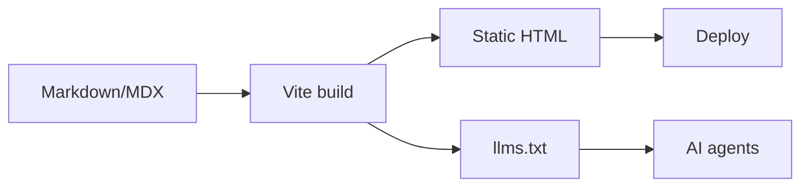
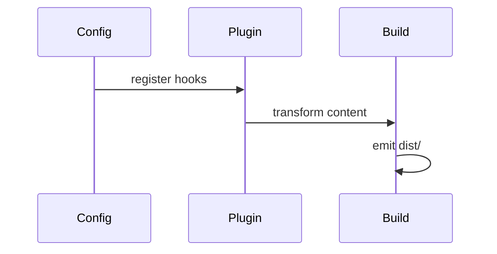

# Mermaid diagrams

The showcase registers `@preactpress/plugin-mermaid` in config.

## Documentation flow

```mermaid
flowchart LR
  A[Markdown/MDX] --> B[Vite build]
  B --> C[Static HTML]
  B --> D[llms.txt]
  C --> E[Deploy]
  D --> F[AI agents]
```

## Plugin pipeline

```mermaid
sequenceDiagram
  participant Config
  participant Plugin
  participant Build
  Config->>Plugin: register hooks
  Plugin->>Build: transform content
  Build->>Build: emit dist/
```
