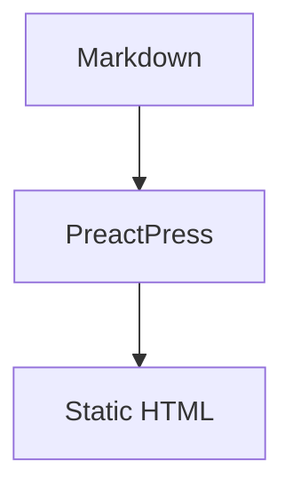

# @preactpress/plugin-mermaid

Official Mermaid diagram plugin for [PreactPress](https://github.com/kamod-ch/preactpress). This package is the reference implementation for the PreactPress plugin system.

## Installation

```bash
pnpm add -D @preactpress/plugin-mermaid
```

Peer dependency: `@kamod-ch/preactpress` >= 2.2.0

## Usage

```ts
import { defineConfig } from "@kamod-ch/preactpress/config";
import { mermaidPlugin } from "@preactpress/plugin-mermaid";

export default defineConfig({
  plugins: [mermaidPlugin()],
});
```

Markdown:

````md

````

## Behavior

- **Progressive enhancement** — build output includes an accessible static fallback (`<figure>` + `<pre>`). Client JavaScript replaces it with SVG when Mermaid loads.
- **Dark mode** — follows `data-theme` on `<html>` and `prefers-color-scheme`.
- **No runtime cost on diagram-free pages** — Mermaid is dynamically imported only when `.pp-mermaid` blocks exist.
- **Accessible fallback** — source remains readable without JavaScript; rendered SVG gets `role="img"`.
- **Clear errors** — invalid diagrams show a readable alert and collapsible source.
- **CSP-friendly** — no inline scripts; only dynamic module import and DOM updates.
- **Multiple diagrams** — every fence on a page is rendered independently.

Styles ship with the client module (`@preactpress/plugin-mermaid/client`). Import the CSS manually if you use a custom theme:

```ts
import "@preactpress/plugin-mermaid/style.css";
```

## API

### `mermaidPlugin(options?)`

| Option      | Type       | Default       | Description                              |
| ----------- | ---------- | ------------- | ---------------------------------------- |
| `languages` | `string[]` | `["mermaid"]` | Fence language ids handled by the plugin |

### `renderMermaidFenceHtml(source: string)`

Build-time helper that returns the static HTML for a diagram block. Useful for tests and custom integrations.

## Example project

```bash
cd packages/plugin-mermaid/examples/basic
pnpm install
pnpm dev
```

## Testing

```bash
pnpm --filter @preactpress/plugin-mermaid test
```

## Plugin hooks used

| Hook                | Purpose                                         |
| ------------------- | ----------------------------------------------- |
| `transformMarkdown` | Normalizes ` ```MERMAID ` fences                |
| `transformFence`    | Emits accessible static HTML for Mermaid blocks |
| `client`            | Registers client-side SVG rendering             |

## License

MIT
