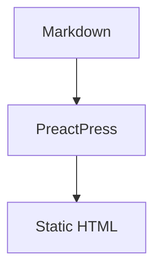
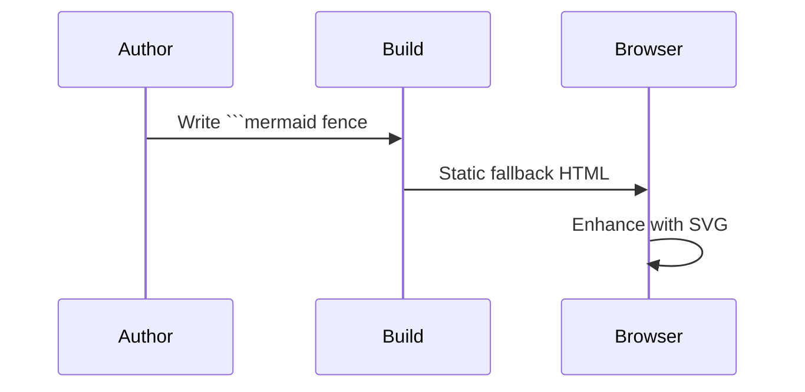

# Mermaid diagrams

PreactPress renders Mermaid diagrams from fenced code blocks:



## Sequence diagram



## Invalid diagram

```mermaid
graph TD
  A --> B
  this is not valid mermaid
```

Without JavaScript, the diagram source remains visible as an accessible fallback.
