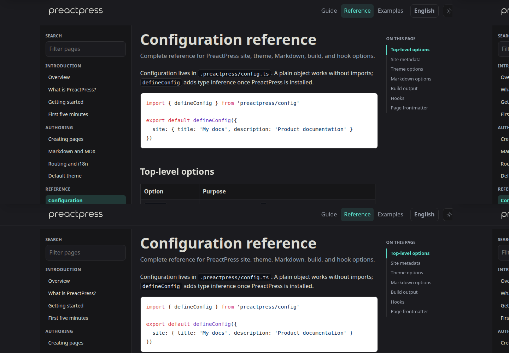
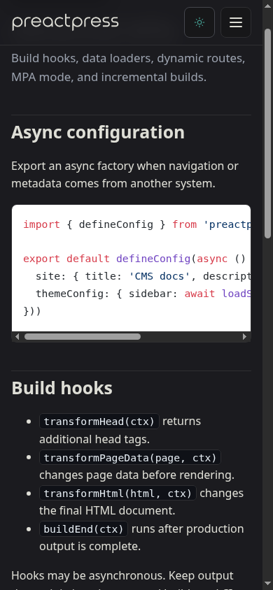
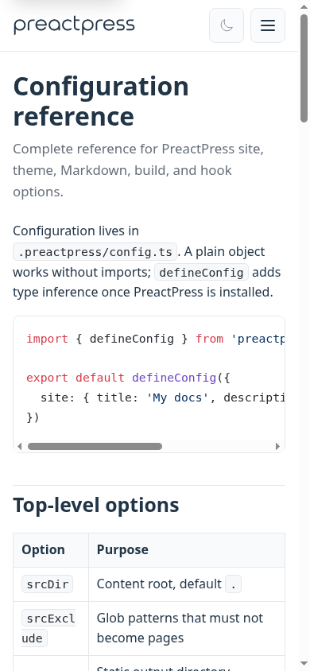
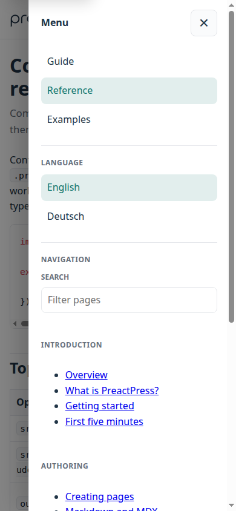
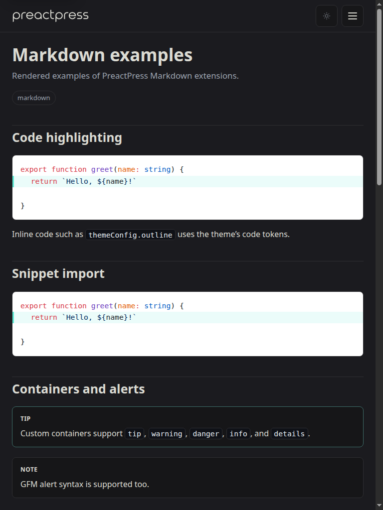

# ProofShot Verification Report

**Date:** 2026-06-08 15:23:32
**Project:** preactpress
**Dev Server:** pnpm run dev:docs on localhost:5173

## What Was Verified

Verify PreactPress responsive docs drawer, focus behavior, dark mode, and content overflow

## Video Recording

Full session recording: [session.webm](./session.webm) (143s)

## Screenshots

## Console Errors

No console errors detected.

## Server Errors

No server errors detected.

## Environment
- Browser: Chromium (headless)
- Viewport: 1280x720
- Duration: 143 seconds
