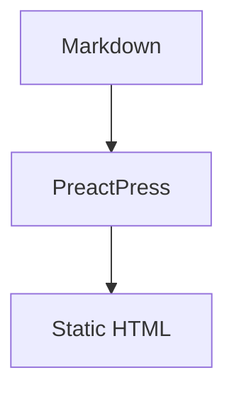
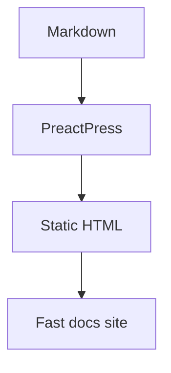
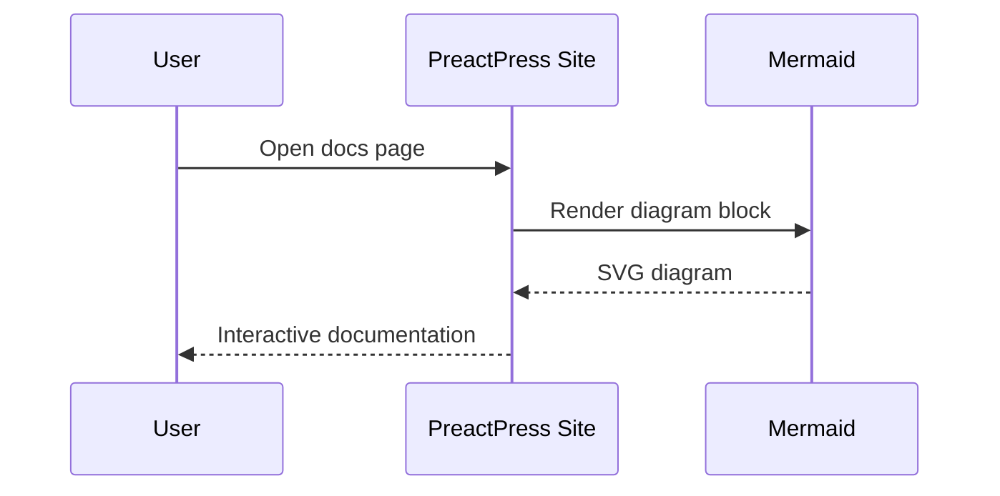
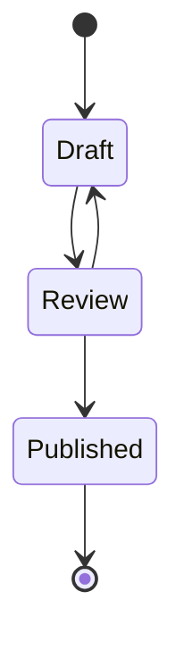

PreactPress renders Mermaid diagrams from fenced code blocks. Use the `mermaid` language name:

````md

````

## Flowchart



## Sequence diagram



## State diagram



Mermaid is loaded on the client only when a page contains a diagram.
