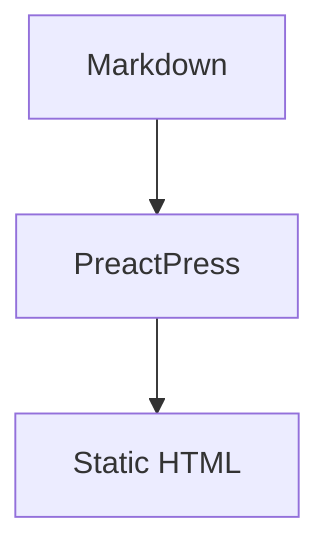

# Mermaid plugin

PreactPress ships Mermaid support as an official plugin package: `@preactpress/plugin-mermaid`.

```ts
import { defineConfig } from "@kamod-ch/preactpress/config";
import { mermaidPlugin } from "@preactpress/plugin-mermaid";

export default defineConfig({
  plugins: [mermaidPlugin()],
});
```

Markdown:

````md

````

## Features

- Static HTML fallback with accessible source text
- Client-side SVG rendering with progressive enhancement
- Dark mode via `data-theme` and `prefers-color-scheme`
- Dynamic Mermaid import only on pages with diagrams
- Clear error output for invalid diagram syntax
- CSP-friendly (no inline scripts)

See the [package README](https://github.com/kamod-ch/preactpress/tree/main/packages/plugin-mermaid) for API details and the example project.
